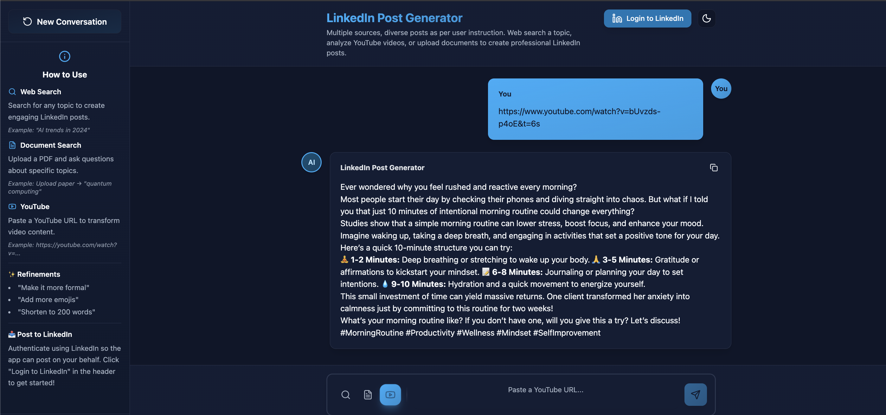

## LinkedIn Post Generator

An AI-powered application agent that turns topics, YouTube videos, and PDFs into engaging LinkedIn posts. Includes a React UI and an alternative Streamlit UI.

### Features

- **Web research**: Uses Tavily + Exa to gather fresh info, with automatic content truncation to prevent context overflow
- **YouTube to post**: Downloads audio via yt-dlp and transcribes with OpenAI Whisper API for videos ≤15 minutes
- **PDF to post**: Upload up to 3MB; automatic direct/RAG handling via ChromaDB for large documents (>80k tokens)
- **Refinements**: Ask to shorten, change tone, add/remove emojis, etc. with conversation history support
- **LinkedIn posting**: OAuth + post directly from the app

### Tech Stack

- **Backend**: FastAPI, OpenAI Agents SDK, OpenAI (GPT-4o-mini, Whisper API), ChromaDB, Instructor, Pydantic, Logfire
- **Tools**: Tavily API, Exa API, yt-dlp (audio download), OpenAI Whisper API (transcription), pypdf (PDF parsing), tiktoken (tokenization)
- **Frontend (primary)**: React 19 + TypeScript, Vite, Tailwind CSS, shadcn/ui, axios
- **Frontend (alt)**: Streamlit app for quick local usage

### Project Structure

```
.
├── backend/
│   ├── main.py                     # FastAPI app with all API endpoints
│   ├── prompts.py                  # LinkedIn system prompts and document grounding rules
│   ├── models/
│   │   └── schema.py               # Pydantic models for validation
│   └── tools/
│       ├── web_search.py           # Tavily + Exa integration with content truncation
│       ├── youtube_transcribe.py   # yt-dlp + Whisper API transcription
│       └── file_search/            # PDF processing and RAG (ChromaDB)
│           ├── tool.py             # File search tool wrapper
│           ├── rag.py              # Vector store operations
│           ├── document_processor.py # PDF extraction and tokenization
│           └── config.py           # RAG configuration
├── frontend-react/
│   ├── src/
│   │   ├── components/             # UI components (shadcn/ui)
│   │   ├── api/                    # Axios API client
│   │   └── App.tsx                 # Main application
│   └── package.json
├── frontend-streamlit/
│   └── streamlit_ui.py             # Alternative Streamlit interface
├── pyproject.toml                  # Python dependencies (uv)
├── uv.lock                         # Dependency lock file
├── .env.example                    # Environment variables template
└── README.md                  
```

### Prerequisites

- **Python 3.10+** (required for OpenAI Agents SDK compatibility)
- **Node.js 20+** (for React frontend)
- **FFmpeg** (required by yt-dlp for audio extraction)
- **API keys**: 
  - OpenAI API key (required)
  - Tavily API key (for web search)
  - Exa API key (for web search)
  - LinkedIn Client ID and Secret (for posting feature) 

### Environment Variables

Copy `.env.example` to `.env` and fill in your API keys:

```bash
cp .env.example .env
```

Required variables:
```env
OPENAI_API_KEY=sk-your-openai-api-key-here
TAVILY_KEY=tvly-your-tavily-api-key-here
EXA_KEY=your-exa-api-key-here
```

For LinkedIn posting:
```env
LINKEDIN_CLIENT_ID=your-linkedin-client-id
LINKEDIN_CLIENT_SECRET=your-linkedin-client-secret
LINKEDIN_REDIRECT_URI=http://localhost:8000/api/linkedin/callback
FRONTEND_URL=http://localhost:5173
```

**Note**: For LinkedIn OAuth, the redirect URI must match exactly in both your `.env` file and LinkedIn Developer Portal settings.

### Installation

1. **Install FFmpeg** (required for YouTube audio extraction)
   - macOS: `brew install ffmpeg`
   - Ubuntu/Debian: `sudo apt install ffmpeg`
   - Windows: Download from [ffmpeg.org](https://ffmpeg.org/download.html)

2. **Backend dependencies**

```bash
uv sync
```

If you don't have `uv`, install it first:
```bash
pip install uv
```

3. **Frontend dependencies**

```bash
cd frontend-react
npm install
cd ..
```

### Running Locally

**Backend (FastAPI)**

```bash
uv run uvicorn backend.main:app --reload
```

Backend runs at: `http://localhost:8000`
- API docs: `http://localhost:8000/docs`
- Health check: `http://localhost:8000/`

**Frontend (React) - Primary UI**

```bash
cd frontend-react
npm run dev
```

App runs at: `http://localhost:5173`

**Alternative UI (Streamlit)**

```bash
uv run streamlit run frontend-streamlit/streamlit_ui.py
```

Streamlit app runs at: `http://localhost:8501`

### How To Use

- **Web search**: Enter a topic like "AI trends in healthcare" and send.
- **YouTube**: Paste a YouTube URL (≤15 minutes). The app downloads audio via yt-dlp, transcribes with Whisper API, and generates a post
- **PDF**: Click upload, add a PDF (≤3MB). For large PDFs (>80k tokens), automatic RAG indexing via ChromaDB. Then ask questions like "cloud cost optimization" - the UI automatically handles file references
- **Refine**: Ask “make it more formal,” “shorten to 200 words,” “remove emojis,” etc.

### Example Screenshot 

- Depicts response given a youtube video link



### How It Works (High-level)

1. **Input Processing**: 
   - User submits query via POST `/api/generate-post`
   - If a PDF was uploaded, client prefixes message with `[file_id: ...]` pattern
   - Conversation history (last 2 messages) is prepended for context in refinements

2. **Agent Tool Selection** (OpenAI Agents SDK):
   - Agent analyzes the query and automatically selects the appropriate tool:
     - `[file_id: ...]` pattern → `file_search` tool (direct text or RAG via ChromaDB)
     - YouTube URL detected → `youtube_transcribe` tool (yt-dlp + Whisper API)
     - Otherwise → `web_search` tool (Tavily + Exa with content truncation to 4000 chars per result)

3. **Research Execution**:
   - **Web Search**: Parallel queries to Tavily (3 results) and Exa (3 results), deduplicated by URL
   - **YouTube**: Audio download via yt-dlp → OpenAI Whisper API transcription → full transcript
   - **PDF**: 
     - Small docs (<80k tokens): Direct text passed to LLM
     - Large docs (>80k tokens): RAG retrieval with multi-query expansion via ChromaDB

4. **Post Generation** (Instructor + Pydantic):
   - Research data is truncated to 15k tokens max
   - GPT-4o-mini generates structured LinkedIn post following best practices from system prompt
   - Output validated via Pydantic schema: `{ content: str, hashtags: List[str] }`

5. **Response & Refinement**:
   - Client displays formatted post
   - User can refine with follow-up queries (conversation history maintained)
   - Optional: Post directly to LinkedIn via OAuth

### Notes and Limits

- YouTube length limit: 15 minutes
- YouTube transcription: Uses yt-dlp for audio download + OpenAI Whisper API for transcription (works for all videos)
- PDF size limit: 3MB; large docs switch to RAG automatically
- Hashtags are returned separately; the UI combines them for display

### Enhancements for future

- Increase the YouTube video limit and PDF size
- Support multiple document types for RAG (e.g., DOCX, TXT)
- Retrieve and fuse more sources via web search


### Final Thoughts and Thank you note
I would like to thank the ProspelloAI team for an engaging and thoughtfully designed hackathon challenge. Over the course of 48 hours, I built end-to-end product that showcases practical use of the OpenAI SDK, integrated web search via Tavily and Exa, and a deliberate design choice for document handling—selecting between RAG and direct LLM generation through a smart PDF pipeline. The system produces structured outputs using Instructor and Pydantic, features a clean, modern UI, and supports real-world workflows, including posting directly to LinkedIn. Beyond the technical depth, the application serves as a creative partner—helping users brainstorm and post with one click.
I truly enjoyed working on this, hope it helps your team to gauge my technical competence. Look forward to your review and inputs.  Thank you.
